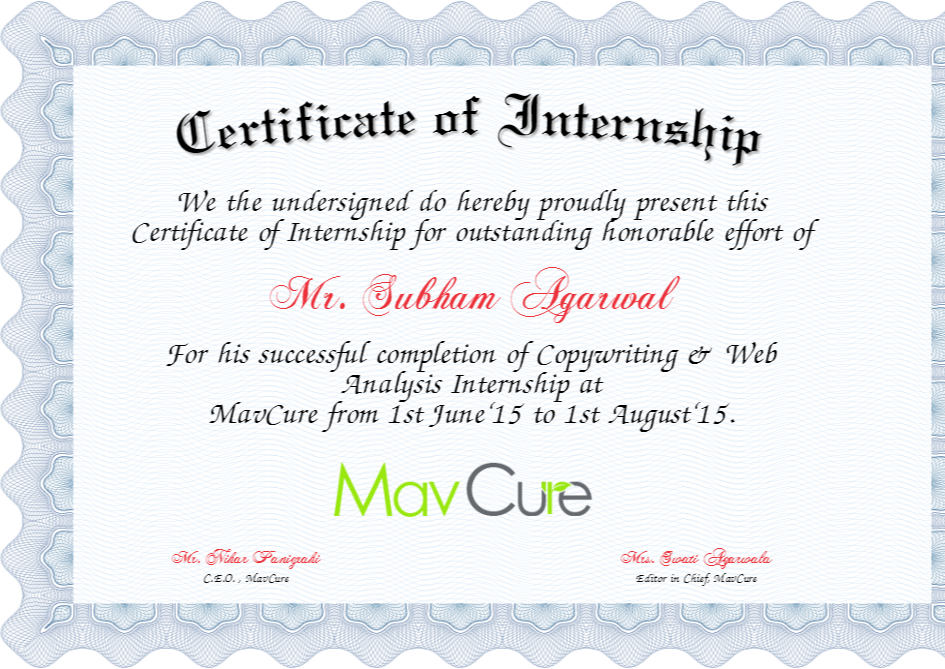

# Preface
Preface forms a vital part of the project work. It is the introductory paragraph which describes about the literary works the author has talked about in the project. It also contains the acknowledgement of all those who helped in making of the project. Refer [this](https://content.wisestep.com/how-to-write-preface-for-project-work-best-tips/) webpage for tips on writing a preface. 

# Acknowledgement
The following acknowledgement has been taken from [this](https://www.template.net/business/report-templates/acknowledgement-report-sample/) page. 

I would like to express my sincere gratitude to my supervisors Dr. Sankalpa Ghosh & Dr. Manish Sharma for providing their invaluable guidance, comments and suggestions throughout the course of the project. I would specially thank Dr. Sankalpa Ghosh for constantly motivating me to work harder and Dr. Manish Sharma for getting me the HOPG samples.

Also I would like to thank Mr. S. Vidyananda for his assistance in the HRTEM imaging, Mr. Sandeep Sharma for his help during the preparation of the sample, Mr. Mandeep Singh for providing me an overview of the TEM image processing software Digital Micrograph.

# About Google
The following has been taken from wikipedia page of [Google](https://en.wikipedia.org/wiki/Google).

Google LLC is an American multinational technology company that specializes in Internet-related services and products, which include online advertising technologies, search engine, cloud computing, software, and hardware. Google was founded in 1998 by Larry Page and Sergey Brin while they were Ph.D. students at Stanford University in California. Together they own about 14 percent of its shares and control 56 percent of the stockholder voting power through supervoting stock. 

# Abstract
Taken from [this](https://scholarworks.uno.edu/cgi/viewcontent.cgi?article=1103&context=aa_rpts) report. 

This report describes the internship I spent at the Krasnodar Regional Center of Fine Arts in Russia. The Art Center is a leading fine arts organization in the Krasnodar Region of the Russian Federation and as such operates under the principles governing arts organization in Russia in general. I describe the managerial structure of the Art Center and responsibilities of each department, explain the specifics of the Art Center and the difficulties, problems and barriers that impact the functioning of the Art Center. I also present an in-depth analysis of the strengths and weaknesses as well as threats and opportunities available to the Art Center as identified through a SWOT analysis. After analyzing the four basic areas of this art organization including management, marketing, development and financial management, and comparing them to best practices in the field, I suggest recommendations to help remedy the weaknesses, emphasize the strengths and resolve identified problems. The steps required to implement the recommendations suggested are also presented. Finally I discuss the contribution to the Art Center including both its short and long-term effects of my participation on the organization. 

# Table of Contents
[Preface](#preface)   
[Acknowledgement](#acknowledgement)   
[About Google](#about-google)   
[Abstract](#abstract)   
[Table of Contents](#table-of-contents)   
[List of Figures](#list-of-figures)   
[List of Tables](#list-of-tables)   
[List of Abbreviations](#list-of-abbreviations)   
[Introduction](#introduction)   
[Problem definition](#problem-definition)   
[Approach](#approach)   
&ensp;&ensp;&ensp;[Current](#current)   
&ensp;&ensp;&ensp;[Novelty](#novelty)   
&ensp;&ensp;&ensp;[Experimental approach](#experimental-approach)   
[Results and Discussion](#result-and-discussion)   
[Learning and Outcome](#learning-outcomes)   
[Summary](#summary)   
[Future Scope](#future-scope)   
[Certificate](#certificate)   

# List of Figures
|Figure #| Figure Title|
|-|-|
|1|IIT Palakkad Logo|
|2|
|3|

# List of Tables
|Table #| Table Title|
|-|-|
|1|Name of Table|
|2|
|3|

# List of Abbreviations
|Abbreviation| Meaning|
|-|-|
|abb|Abbreviation|
|ie| That is
|iot| internet of things

# Introduction
Start here. Lorem Ipsum is simply dummy text of the printing and typesetting industry. Lorem Ipsum has been the industry's standard dummy text ever since the 1500s, when an unknown printer took a galley of type and scrambled it to make a type specimen book. It has survived not only five centuries, but also the leap into electronic typesetting, remaining essentially unchanged. It was popularised in the 1960s with the release of Letraset sheets containing Lorem Ipsum passages, and more recently with desktop publishing software like Aldus PageMaker including versions of Lorem Ipsum.

# Problem Definition
Define the problem here. Lorem Ipsum is simply dummy text of the printing and typesetting industry. Lorem Ipsum has been the industry's standard dummy text ever since the 1500s, when an unknown printer took a galley of type and scrambled it to make a type specimen book. 

_Figure 1: IIT Palakkad Logo._

It has survived not only five centuries, but also the leap into electronic typesetting, remaining essentially unchanged. It was popularised in the 1960s with the release of Letraset sheets containing Lorem Ipsum passages, and more recently with desktop publishing software like Aldus PageMaker including versions of Lorem Ipsum.

# Approach
Describe the approach here. Lorem Ipsum is simply dummy text of the printing and typesetting industry. Lorem Ipsum has been the industry's standard dummy text ever since the 1500s, when an unknown printer took a galley of type and scrambled it to make a type specimen book. It has survived not only five centuries, but also the leap into electronic typesetting, remaining essentially unchanged. It was popularised in the 1960s with the release of Letraset sheets containing Lorem Ipsum passages, and more recently with desktop publishing software like Aldus PageMaker including versions of Lorem Ipsum.
## Current
Describe the current approach to solve the problem here. Lorem Ipsum is simply dummy text of the printing and typesetting industry. Lorem Ipsum has been the industry's standard dummy tex
## Novelty
Describe why your approach is novel and what are the perks of using your approach. Lorem Ipsum is simply dummy text of the printing and typesetting industry. Lorem Ipsum has been the industry's standard dummy text ever since the 1500s, when an unknown printer took a galley of type and scra
## Experimental Approach
Describe the experimental or simulational approach. Lorem Ipsum is simply dummy text of the printing and typesetting industry. Lorem Ipsum has been the industry's standard dummy text ever since the 1500s, when an unknown printer took a galley of type and scrambled it to make 

# Results and Discussion
The Result and Discussion goes here. Lorem Ipsum is simply dummy text of the printing and typesetting industry. Lorem Ipsum has been the industry's standard dummy text ever since the 1500s, when an unknown printer took a galley of type and scrambled it to make a type specimen book. 

|Header1|Header2|Header3|
|-------|-------|-------|
|Value1 |Value2 |Value3
_Table 1: Sample Table_

It has survived not only five centuries, but also the leap into electronic typesetting, remaining essentially unchanged. It was popularised in the 1960s with the release of Letraset sheets containing Lorem Ipsum passages, and more recently with desktop publishing software like Aldus PageMaker including versions of Lorem Ipsum.

# Learning and Outcome
Describe what you've learnt and the outcome of the internship, a prototype, a product design etc. Lorem Ipsum is simply dummy text of the printing and typesetting industry. Lorem Ipsum has been the industry's standard dummy text ever since the 1500s, when an unknown printer took a galley of type and scrambled it to make a type 

# Summary
Summarize the work here. Lorem Ipsum is simply dummy text of the printing and typesetting industry. Lorem Ipsum has been the industry's standard dummy text ever since the 1500s, when an unknown printer took a galley of type and scrambled it to make a type specimen book. It has survived not only five centuries, but also the 

# Future Scope
Describe the future scope of the work, improvements, analysis etc. Lorem Ipsum is simply dummy text of the printing and typesetting industry. Lorem Ipsum has been the industry's standard dummy text ever since the 

# Certificate
Could also be found [here](https://drive.google.com/)

